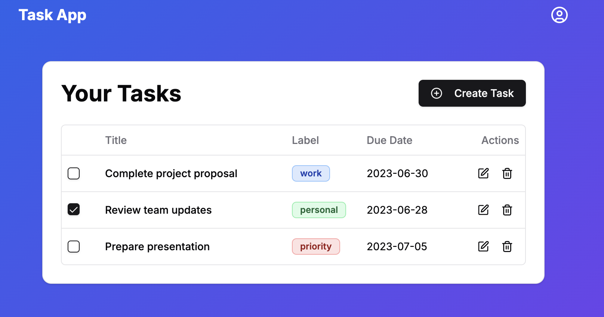

# Task App: Fullstack SaaS Project Tutorial 2025

A full-stack SaaS task management application built with Next.js and Supabase, featuring AI-powered task labeling, image attachments, and Stripe subscriptions.

- Specific tutorial documents can be found in the `/tutorial` folder.
- Project design and spec can be found at [tutorial/PROJECT_DESIGN.md](tutorial/PROJECT_DESIGN.md).



## Features

- Task management with automatic AI labeling
- Image attachments with cloud storage
- Google OAuth and email authentication
- Premium subscription with Stripe integration
- Usage limits and tracking

## Tech Stack

- Frontend: Next.js, React, TypeScript, Tailwind CSS
- Backend: Supabase (PostgreSQL, Auth, Storage, Edge Functions)
- AI: OpenAI
- Payments: Stripe

## Quick Start

### Prerequisites

- Node.js and npm
- Supabase CLI
- Stripe CLI (optional)
- Account credentials for:
  - Supabase
  - OpenAI
  - Stripe (test mode)

### Local Development Setup

1. Clone and install dependencies:

```bash
# From project root.
npm install
```

2. Create environment files - update the values with your keys.
```bash
cp .env.example .env.local
cp .env.example .env.test.local
```

3. Run development server:
```bash
npm run dev
# Visit http://localhost:3000
```

At this stage, it won't work well yet because we haven't set up the backend.

### Supabase Setup

1. Create new Supabase project at supabase.com

2. Link project:
```bash
supabase init
supabase link --project-ref your-project-ref
```

3. Deploy database and functions:

```bash
# Apply DB migrations
supabase db push

# Or you can use this command if you need to nuke the DB and reset it.
# supabase db reset --linked

# Deploy edge functions
supabase functions deploy create-task-with-ai
supabase functions deploy create-stripe-session
supabase functions deploy stripe-webhook
```

4. Disable `Enforce JWT Verification` ( **Edge Functions > stripe-webhook > Details > Enforce JWT Verification**) for your Stripe webhook Edge Function.

5. Disable email confirmation in Supabase Dashboard:
   - Authentication > Providers > Email
   - Uncheck "Confirm email"

### OpenAI Setup

1. Get API key from platform.openai.com
2. Set as Supabase secret:

```bash
supabase secrets set OPENAI_API_KEY=your-key
```

### Stripe Setup

1. Create Stripe test account and get API keys

2. Create subscription product:

```bash
stripe prices create \
  --currency=usd \
  --unit-amount=1000 \
  -d "recurring[interval]"=month \
  -d "recurring[trial_period_days]"=14 \
  -d "product_data[name]"="TaskMaster Premium"
```

3. Configure customer portal:

```bash
stripe billing_portal configurations create \
  -d "business_profile[privacy_policy_url]=https://your-site.com/privacy" \
  -d "business_profile[terms_of_service_url]=https://your-site.com/terms" \
  -d "default_return_url=http://localhost:3000/profile" \
  -d "features[subscription_cancel][enabled]=true" \
  -d "features[payment_method_update][enabled]=true"
```

4. Set up webhook in Stripe Dashboard:
   - Endpoint: `https://[PROJECT_ID].supabase.co/functions/v1/stripe-webhook`
   - Events: `checkout.session.completed`, `customer.subscription.deleted`, `customer.subscription.updated`

### Required Environment Variables

Add to `.env.local` and `.env.test.local`:

```bash
# Add this to both:
NEXT_PUBLIC_SUPABASE_URL=https://your-project.supabase.co
NEXT_PUBLIC_SUPABASE_ANON_KEY=your-anon-key

# Only .env.test.local needs these:
SUPABASE_SERVICE_KEY=your-service-key
STRIPE_SECRET_KEY=sk_test_...
STRIPE_PRICE_ID=price_...
STRIPE_WEBHOOK_SECRET=whsec_...
```

### Set Supabase Secrets

Your Edge Functions will also need those environment variables. Set them like this:

```bash
supabase secrets set OPENAI_API_KEY="sk-xxx..."
supabase secrets set STRIPE_SECRET_KEY=sk_test_xxx
supabase secrets set STRIPE_PRICE_ID=price_xxx
supabase secrets set STRIPE_WEBHOOK_SECRET=whsec_xxx
```

### Running Tests

```bash
# Run all tests
npm test

# Run specific test file
npm test tests/integration/2_auth.test.ts

# Run specific test case
npm test tests/integration/5_task_limits.test.ts -- -t "free user cannot exceed task limit"
```

### Testing Locally

Start development server and go to the local site for testing.

```bash
npm run dev
```

## Project Structure

```text
taskapp/
├── app/               # Next.js pages and layouts
├── components/        # React components
├── hooks/             # Application logic
│   ├── useAuth.ts     # Authentication
│   ├── useTask.ts     # Task management
│   └── useUser.ts     # User profile/subscription
├── supabase/
│   ├── functions/     # Edge Functions
│   └── migrations/    # Database migrations
└── tests/
    └── integration/   # Integration tests
```
