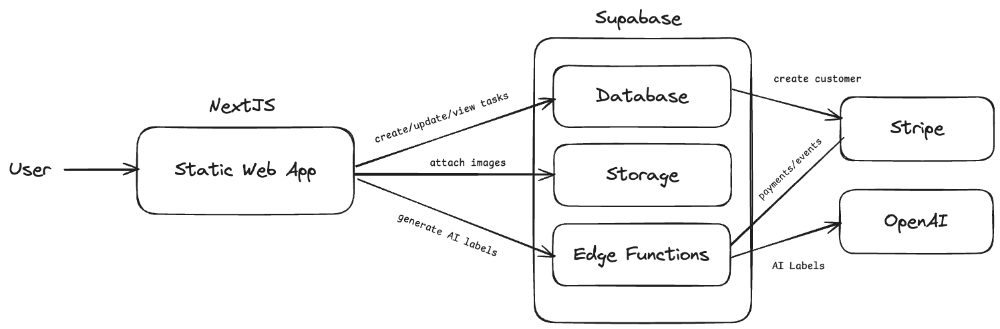
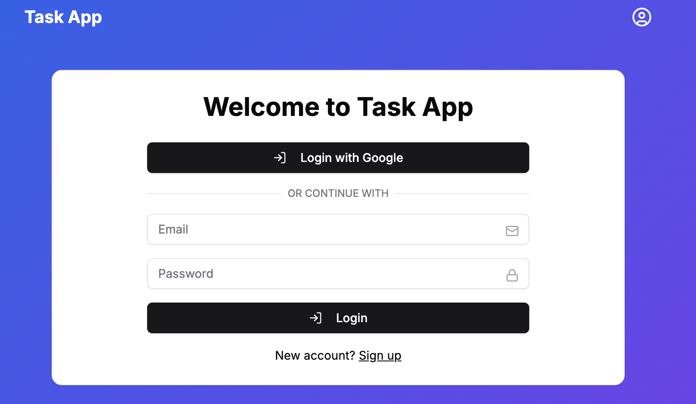
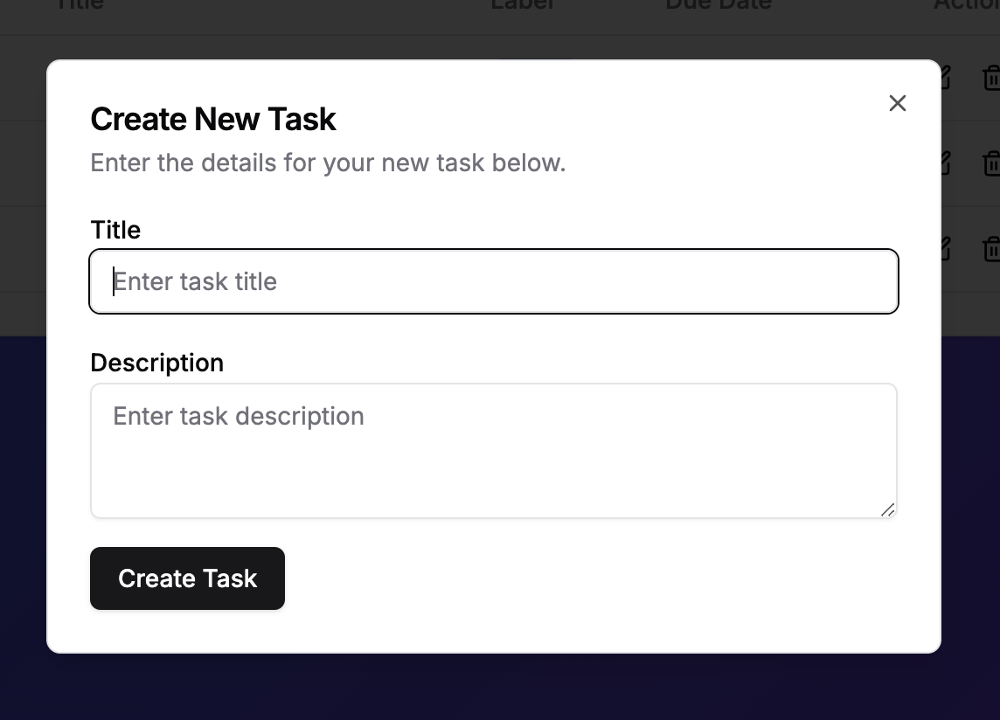
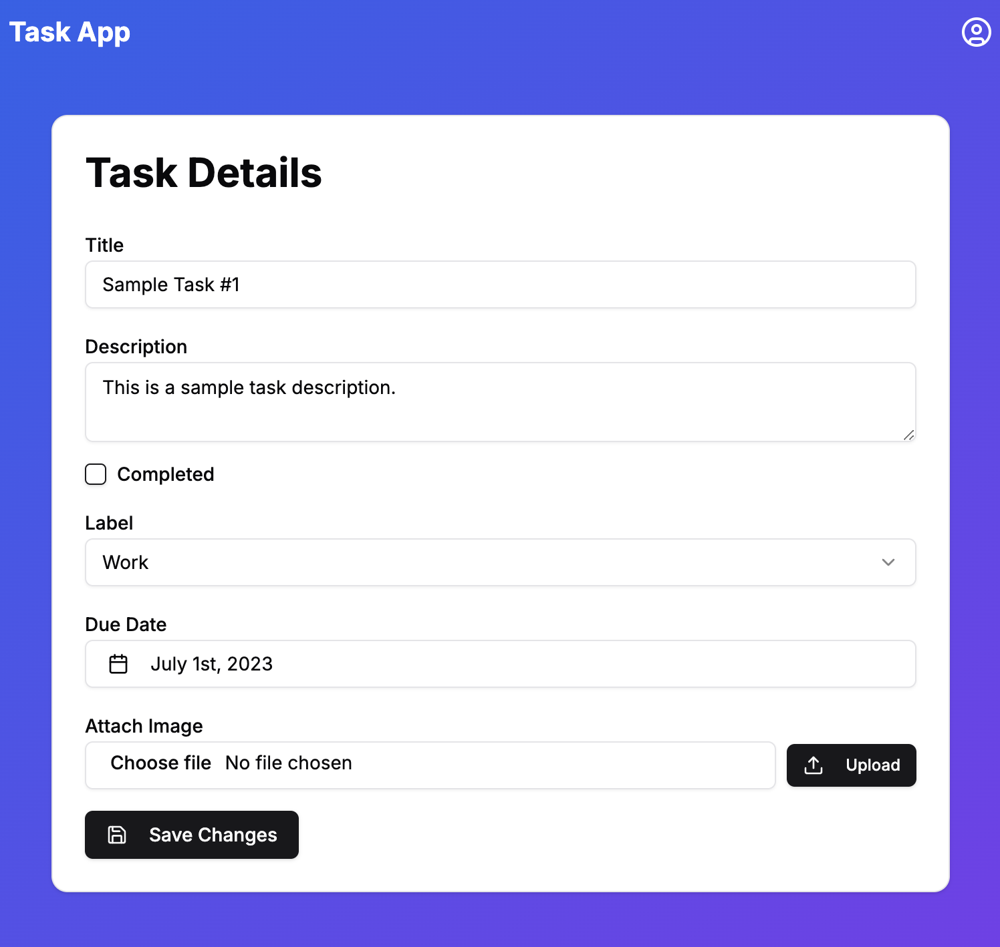
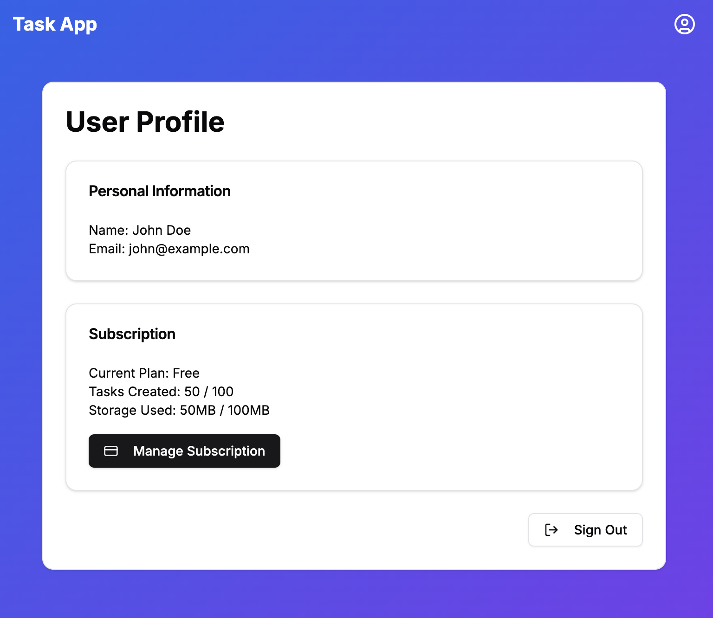

# Task App: Project Spec

TaskApp is a task management SaaS application built with Next.js and Supabase. It provides users with a clean interface to manage their tasks, complete with AI-powered task labeling and image attachments.

## App Views

User can log in with Google or email/password.

If logged in, users will be re-directed to the dashboard.

Users can create a new task.

Users can also edit an existing one.

On the Profile page, users can view their usage, manage their premium subscription, or log out.

## Product Features

A list of key product features, and the key technology used to implement it.

| Feature              | Description                                                            | Tech           |
| -------------------- | ---------------------------------------------------------------------- | -------------- |
| Task CRUD            | Can create, update and delete tasks.                                   | Database       |
| Task Details         | Tasks can have details like: title, description, due date.             | Database       |
| Image Attachments    | An image of up to 1MB can be attached to a task.                       | Storage        |
| User System          | Users can log in with email or Google.                                 | Auth           |
| User Auth            | Tasks are protected by authorization.                                  | Auth           |
| AI Labels            | Use AI to generate automatic labels (tags) upon task creation.         | Edge Functions |
| Usage Limits         | Task creation is limited to 100 tasks for free users, 10k for premium. | DB Triggers    |
| Premium Subscription | Users can upgrade to premium for $10 / month.                          | Stripe         |

## Data Model

### Profiles Table

| Column             | Type    | Description                            |
| ------------------ | ------- | -------------------------------------- |
| user_id            | uuid    | Primary key, references auth.users(id) |
| name               | text    | User's display name                    |
| subscription_plan  | text    | User's plan (free/premium)             |
| tasks_limit        | integer | Task creation limit (100/10000)        |
| stripe_customer_id | text    | Stripe customer identifier             |

### Tasks Table

| Column      | Type      | Description                     |
| ----------- | --------- | ------------------------------- |
| task_id     | uuid      | Primary key                     |
| user_id     | uuid      | Foreign key to profiles.user_id |
| title       | text      | Task title (required)           |
| description | text      | Task description                |
| image_url   | text      | URL to attached image           |
| label       | text      | Task label (work/personal/etc)  |
| due_date    | timestamp | When task is due                |
| completed   | boolean   | Whether task is completed       |

### Usage Tracking Table

| Column        | Type    | Description                              |
| ------------- | ------- | ---------------------------------------- |
| user_id       | uuid    | Foreign key to profiles.user_id          |
| year_month    | text    | Month of tracking (YYYY-MM format)       |
| tasks_created | integer | Number of tasks created in current month |

## Premium Model

The premium subscription ($10/month) includes a 14-day trial and is managed through Stripe integration.

Each user automatically gets a Stripe customer ID on sign-up, with subscription changes handled through webhooks. When users upgrade, their task limit increases from 100 to 10,000 tasks per month.

Cancellations are processed through Stripe's billing portal, automatically reverting users to the free tier (when the actual subscription expires). The entire subscription lifecycle is automated through database triggers and webhook handlers.

The "Manage Subscription" button will take the user to either the check out page (if they have never subscribed before), or to the billing portal where they can manage, cancel, or renew.

## Edge Functions

| Function              | Description                                                                             |
| --------------------- | --------------------------------------------------------------------------------------- |
| create-task-with-ai   | Creates tasks and uses AI to automatically generate labels for them.                    |
| create-stripe-session | Creates Stripe checkout/billing portal sessions for premium subscriptions.              |
| stripe-webhook        | Handles Stripe webhook events for subscription management (begin or end subscriptions). |

## Database Triggers

| Trigger Name                               | What it Does                                                                      |
| ------------------------------------------ | --------------------------------------------------------------------------------- |
| on_auth_user_created                       | Creates a new profile in profiles table when a user signs up.                     |
| create_stripe_customer_on_profile_creation | Creates a Stripe customer for the user and saves the Stripe ID.                   |
| delete_stripe_customer_on_profile_deletion | Deletes the associated Stripe customer when a profile is deleted.                 |
| cleanup_storage_on_task_delete             | Deletes any attached image from storage when a task is deleted.                   |
| increment_task_count_after_insert          | Increments the monthly task counter in usage tracking when a new task is created. |
| enforce_task_limit                         | Checks if creating a new task would exceed the user's monthly limit.              |
| update_task_limit                          | Updates the task limit when subscription changes.                                 |
